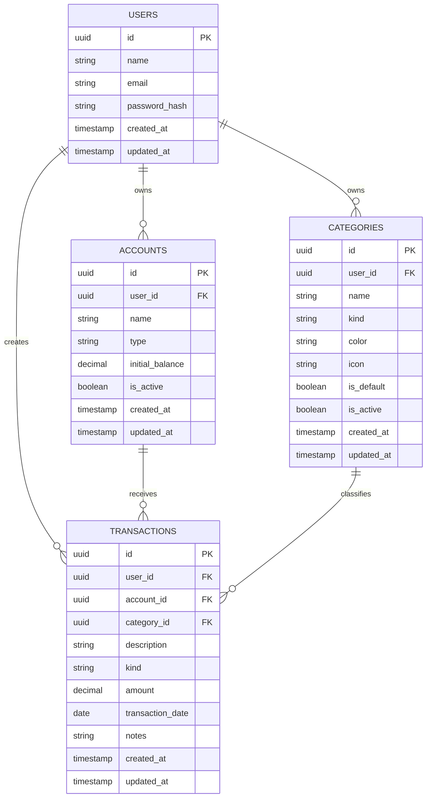

# Modelagem de Dados

## Entidades principais

### Usuario

- `id`
- `name`
- `email`
- `password_hash`
- `created_at`
- `updated_at`

### Conta

- `id`
- `user_id`
- `name`
- `type`
- `initial_balance`
- `is_active`
- `created_at`
- `updated_at`

### Categoria

- `id`
- `user_id`
- `name`
- `kind`
- `color`
- `icon`
- `is_default`
- `is_active`
- `created_at`
- `updated_at`

### Lancamento

- `id`
- `user_id`
- `account_id`
- `category_id`
- `description`
- `kind`
- `amount`
- `transaction_date`
- `notes`
- `created_at`
- `updated_at`

## Relacionamentos

- Um usuario possui varias contas
- Um usuario possui varias categorias
- Um usuario possui varios lancamentos
- Uma conta possui varios lancamentos
- Uma categoria possui varios lancamentos

## Observacoes de modelagem

- O saldo atual nao precisa ser persistido na conta; ele pode ser calculado.
- O campo `kind` sera usado para diferenciar receita e despesa.
- Categorias podem ser padrao do sistema ou criadas pelo proprio usuario.
- O MVP nao inclui parcelamento e recorrencia; essas tabelas podem entrar em sprints futuras.

## Diagrama ER

